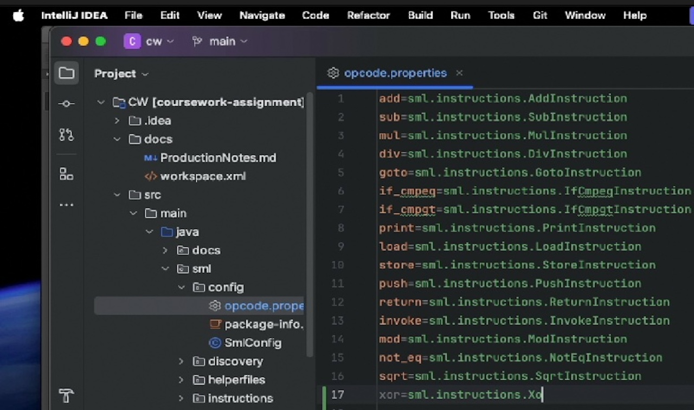
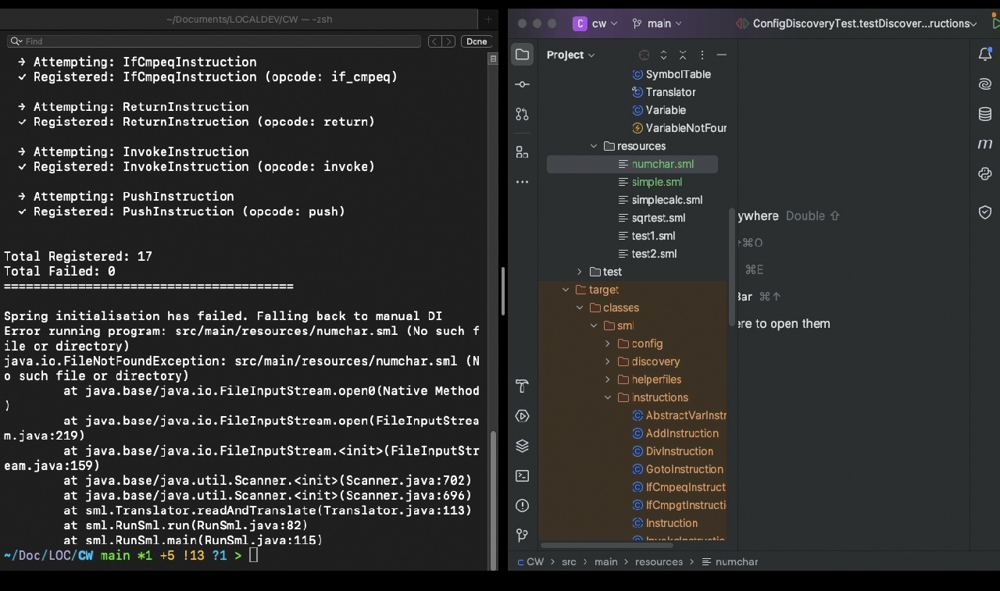
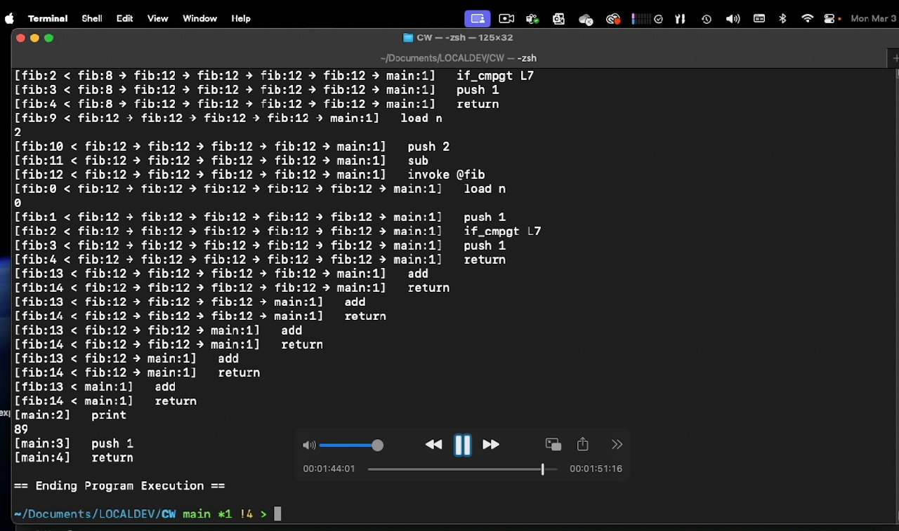
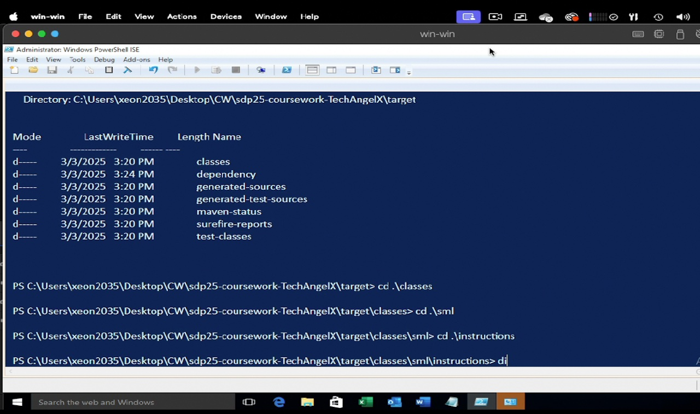

# 🏛 Machine Language Interpreter (SML)

## Project Overview

SML is a command-line interface tool that implements a low-level Machine Language compiler and interpreter. Developed as part of an assessment for the Software Design and Programming module as part of my MSc Computer Science degree, the system mimics the architecture of the Java Virtual Machine (JVM). It utilises a stack-based execution model to parse and run custom assembly-like instructions.

Not finished yet and still a work-in-progress, the purpose of this project was to learn advanced Java concepts, specifically Dependency Injection with Spring, the Reflection API, and architectural design patterns in a practical context. The project also includes a comprehensive test suite, showcasing strong utilisation of the JUnit testing framework.

The primary engineering challenge was to design the system for **open-ended extensibility** using advanced Java features like Reflection and Dependency Injection.

<table>
  <tr>
    <th align="center">Config Registration Process</th>
    <th align="center">Package Scan Process</th>
  </tr>
  <tr>
    <td align="center">
      
      <br>
      <em>System reads mapping from external config</em>
    </td>
    <td align="center">
      
      <br>
      <em>System auto-detects classes via Reflection</em>
    </td>
  </tr>
</table>

## Tech Stack & Key Concepts

- **Language:** Java (JDK 17+)
- **Frameworks:** Spring Context (Dependency Injection)
- **Build Tool:** Maven
- **Testing:** JUnit 5 (High coverage)

---

## Key Features & Implementation

### 1. Dynamic Instruction Extensibility (Reflection)

A core requirement was to replace standard `switch` statements with a dynamic loading system. This allows third-party developers to add new machine instructions (opcodes) without recompiling the source code.

I implemented two distinct mechanisms for instruction discovery:

1. **Configuration-Driven:** Loading instruction mappings from an external file.
2. **Auto-Discovery:** Scanning the classpath to automatically register available instruction classes.

### 2. Dependency Injection

The project leverages the **Spring Framework** to manage the `Machine` context. By removing hard dependencies and utilising Inversion of Control (IoC), the system components (Translator, Registers, Memory) are loosely coupled, significantly improving testability and modularity.

### 3. SML Language Specification

The interpreter supports a variety of operations, handling the "Fetch-Decode-Execute" cycle for:

- **Arithmetic:** `add`, `sub`, `mul`, `div`
- **Control Flow:** `goto`, `if_cmpgt` (branch if >), `if_cmpeq` (branch if =)
- **Memory:** `load` (variable to stack), `store` (stack to variable)
- **Functions:** `invoke` (method calls), `return`
- **I/O:** `print`

---

## Language Specification

The SML interpreter is based on a stack machine architecture similar to the JVM. It operates exclusively on the `int` data type using a system of Frames:

- **Current Frame:** Represents the currently executing method. It contains local variables, arguments, and an Operand Stack.
- **Operand Stack:** The primary work area. Instructions pop operands from this stack, perform operations (e.g., math, comparisons), and push results back onto it.
- **Method Invocation:** When a method is invoked (`invoke`), a new frame is created and pushed onto the execution stack. When `return` is called, the current frame is destroyed, and control (along with the return value) passes back to the invoker.

---

## Execution Architecture / Instruction Format

Each instruction follows a specific syntax:
```
[label:] opcode parameter-list
```

- **Label (Optional):** A sequence of non-whitespace characters ending in a colon (e.g., `L7:`). Used as a target for jump instructions.
- **Opcode:** The operation name (e.g., `add`, `load`).
- **Parameter List:** Comma-separated arguments, which can be:
  - `I`: Integer literal
  - `V`: Variable name
  - `L`: Label reference
  - `M`: Method name

---

## Instruction Set

| Opcode | Parameters | Description |
|--------|------------|-------------|
| **Data Movement** |||
| `load` | V | Pushes the value of variable `V` onto the operand stack. |
| `store` | V | Pops a value from the stack and stores it in variable `V`. |
| `push` | I | Pushes the integer constant `I` onto the stack. |
| **Arithmetic** |||
| `add` | - | Pops two values, adds them, and pushes the result. |
| `sub` | - | Pops two values, subtracts them, and pushes the result. |
| `mul` | - | Pops two values, multiplies them (lower 32-bits), and pushes the result. |
| `div` | - | Pops two values, divides them, and pushes the result. |
| **Control Flow** |||
| `goto` | L | Unconditionally jumps to label `L`. |
| `if_cmpgt` | L | Pops two values; if `value1 > value2`, jumps to label `L`. |
| `if_cmpeq` | L | Pops two values; if `value1 == value2`, jumps to label `L`. |
| `invoke` | M | Pops arguments, creates a new frame for method `M`, and transfers control. |
| `return` | - | Returns execution to the caller, pushing the result onto the caller's stack. |
| **I/O** |||
| `print` | - | Pops a value from the stack and displays it on the console. |

---

## Getting Started & Usage

### Prerequisites

- Java SDK 17+
- Maven

### Setup Guide

The application is designed to run via the command line on both Unix-based and Windows systems.

<table>
  <tr>
    <th align="center">Linux / Mac OS CLI</th>
    <th align="center">Windows / PowerShell CLI</th>
  </tr>
  <tr>
    <td align="center">
      <a href="https://youtu.be/5946Zzi-ORM" target="_blank">
        
      </a>
      <br>
      <em>View Setup Video (Mac/Linux)</em>
    </td>
    <td align="center">
      <a href="https://youtu.be/7FYMgWmGP08" target="_blank">
        
      </a>
      <br>
      <em>View Setup Video (Windows)</em>
    </td>
  </tr>
</table>

### How to Run

1. **Clone the repository:**
2. **Build the project:**
3. **Execute a program:**

> **Note:** You *must* run these commands from the root `/sml-interpreter` folder.
```bash
git clone https://github.com/TechAngelX/SML-Interpreter.git sml-interpreter
cd sml-interpreter
mvn clean package
mvn exec:java -Dexec.mainClass="sml.RunSml" -Dexec.args="src/main/resources/test1.sml"
```

Or run any other `.sml` program file:
```bash
mvn exec:java -Dexec.mainClass="sml.RunSml" -Dexec.args="src/main/resources/sqrtest.sml"
```

### Available Example Programs For You To run:

| Program | Description | Output |
|---------|-------------|--------|
| `test1.sml` | Recursive Fibonacci using function calls | `89` (10th Fibonacci number) |
| `test2.sml` | Iterative Fibonacci using loops | `89` (10th Fibonacci number) |
| `simple.sml` | Minimal stack operations demo | `18` |
| `simplecalc.sml` | Arithmetic and conditional branching | `100`, `15` |
| `sqrtest.sml` | Square root instruction tests | `3`, `4`, `5`, `0`, `7`, `100` |
| `numchar.sml` | Number to ASCII character conversion | `RICKI` (as ASCII values) |

---

## Project Retrospective

This project was a significant exercise in refactoring legacy code into a clean, modern architecture.

**Strengths:**

- **Reflection Implementation:** The dual-strategy for instruction loading was robust and highly flexible.
- **Testing:** Achieved extensive unit test coverage for individual instructions.
- **Modern Java:** Utilised pattern matching for `instanceof` and consistent `equals/hashCode` implementation.

**Areas for Improvement:**

- **Dependency Inversion:** While Spring was used, further abstraction (Interfaces) could be introduced to fully satisfy the 'D' in SOLID.
- **Statelessness:** Refactoring the abstract base classes to reduce statefulness in instruction objects would improve thread safety.

---

*Enjoy !"

*Ricki.*
